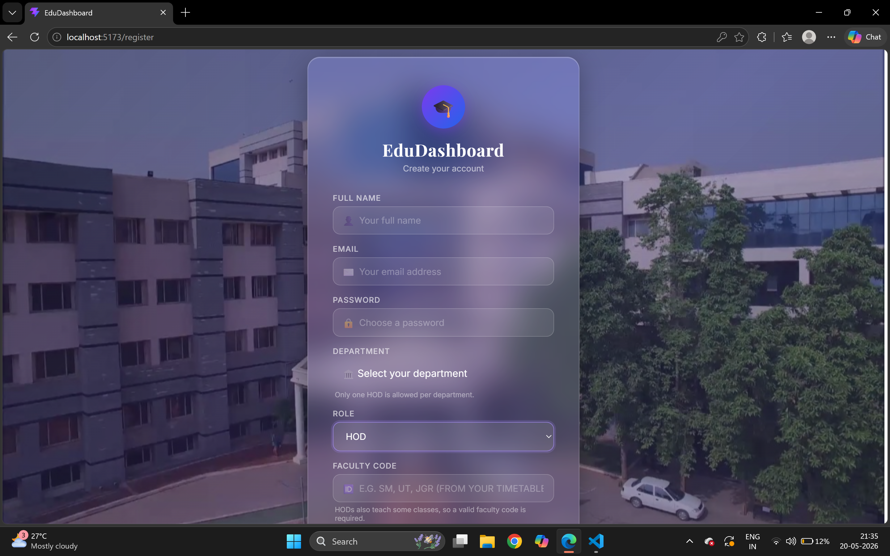
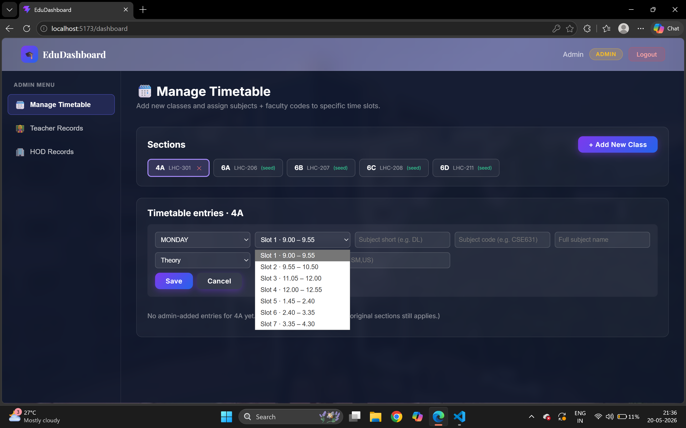
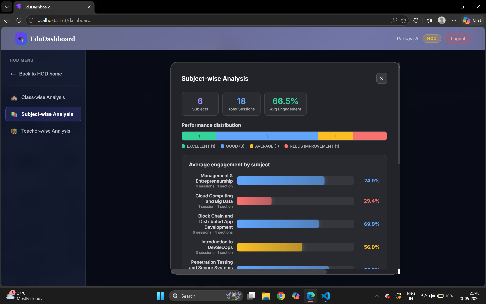
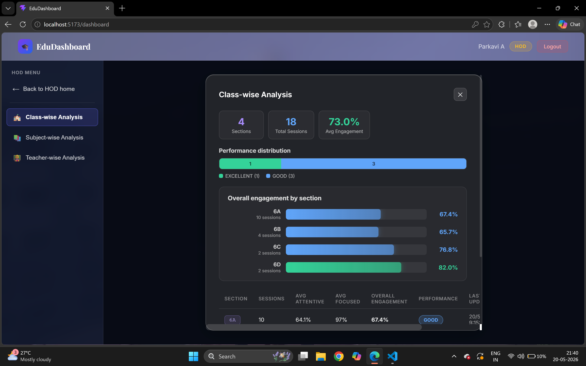
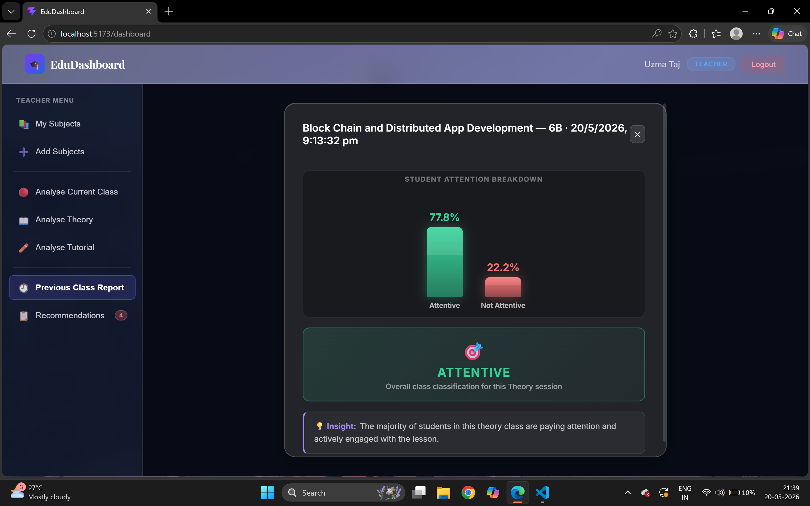
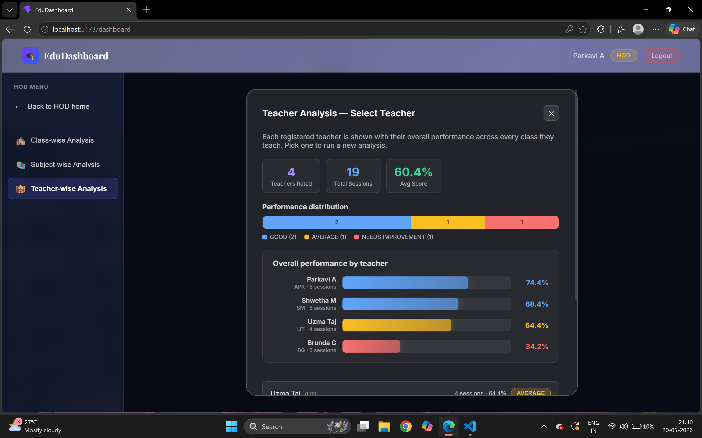
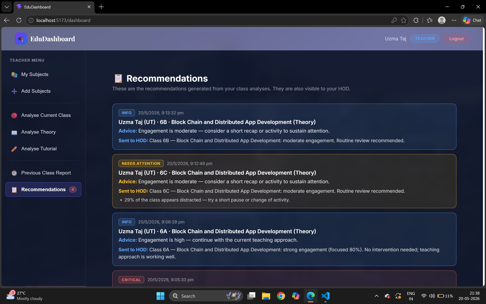

# 🎓 Unified Behavioural Intelligence System for Academic Spaces

A classroom behavioural-intelligence platform that turns classroom video into engagement signals — **student focus**, **attention**, and **teacher enthusiasm** — through a role-based web dashboard for **Teachers**, **HODs**, and **Admins**.

Two backends by design: **Node/Express** owns application state (auth, timetable, sessions), **Flask/Python** wraps the CV/ML pipelines (YOLOv8, MediaPipe, MobileNetV2, LSTM). **React** ties both together.


<p align="center">
  
  
  
  
  
</p>

---

## What it does

| Area | Pipeline |
|---|---|
| **Lab sessions** | YOLOv8 (person detection) → MobileNetV2 → **Focused / Distracted** |
| **Theory / Tutorial** | YOLOv8 / MediaPipe + 3× MobileNetV2 (writing, drowsiness, emotion) → rule-based fusion → **Attentive / Not** |
| **Teacher behaviour** | Teaching-mode CNN + pose/motion features → LSTM → **Enthusiastic / Not** |

---

## Screenshots

### 🔐 Register

<p align="center">
  
</p>

Role-based authentication entry point for the Classroom AI system.

---

### 🛠️ Admin Dashboard

<p align="center">
  
</p>

Administrative interface for managing and accessing system-level classroom information.

---

### 📚 Subject-wise Analysis

<p align="center">
  
</p>

Subject-wise analysis presents behavioural and engagement information for the selected subject.

---

### 📊 Class-wise Analysis

<p align="center">
  
</p>

Class-wise analysis presents aggregated classroom engagement results for the selected class.

---

### 👨‍🎓 Student Analysis

<p align="center">
  
</p>

Student analysis provides student-level behavioural and engagement information from the analysed classroom data.

---

### 👨‍🏫 Teacher Analysis

<p align="center">
  
</p>

Teacher analysis provides insights into teaching behaviour and enthusiasm based on the analysed classroom session.

---

### 💡 Recommendations

<p align="center">
  
</p>

The recommendation module converts behavioural insights into actionable suggestions for improving classroom engagement.

---

## Architecture

```text
                     React + Vite (SPA)
                          │
              ┌───────────┴───────────┐
              ▼                       ▼
       Node + Express               Flask
       (auth, timetable,        (ML orchestration)
        sessions, MongoDB)             │
                                ┌───────┼────────┐
                               LAB    THEORY   TEACHER
                            (YOLO+   (YOLO/    (CNN +
                            MobileNet)MediaPipe) LSTM)
```

---

## Tech Stack

**Frontend:** React, Vite

**App backend:** Node.js, Express, MongoDB, Mongoose, JWT, bcrypt

**ML backend:** Flask, PyTorch, MobileNetV2, YOLOv8n, MediaPipe, OpenCV, LSTM

---

## Getting Started

### Prerequisites

- Node.js 18+ and npm
- Python 3.9+ and pip
- MongoDB (local or Atlas)
- A webcam (optional — falls back to recorded/sample video if unavailable)

### Install

```bash
git clone https://github.com/<your-username>/<your-repo>.git
cd "Unified Behavioural Intelligence System For Academic Spaces"

# Node backend
cd dashboard/backend && npm install

# React frontend
cd ../frontend && npm install

# Flask ML API + ML pipelines
cd ../../flask_api && pip install -r requirements.txt
pip install -r ../final_project/lab/requirements.txt
pip install -r ../final_project/emotions/requirements.txt
```

### Configure

Create `dashboard/backend/.env`:

```env
PORT=5000
MONGO_URI=mongodb://localhost:27017/miniproject
JWT_SECRET=your_jwt_secret_key_here
```

### Run

```bash
# Terminal 1 — Flask ML API (port 8000)
cd flask_api && python app.py

# Terminal 2 — Node API (port 5000)
cd dashboard/backend && npm start

# Terminal 3 — React frontend (port 5173)
cd dashboard/frontend && npm run dev
```

Open **http://localhost:5173**.

Register accounts using the seeded role codes: `teacher123`, `hod123`, `admin123` (HOD needs a valid faculty code from the seeded timetable).

---
